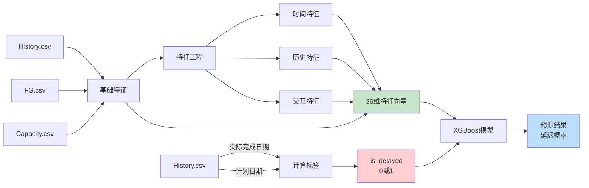

# APS生产延迟预测系统 - 特征与标签说明

## 📊 数据结构概览

### 原始数据来源（5个CSV文件）

1. **History.csv** - 历史生产订单（主数据源）
2. **Order.csv** - 客户订单需求
3. **FG.csv** - 成品物料主数据
4. **Capacity.csv** - 产线产能
5. **APS.csv** - APS生产计划

---

## 🎯 标签（Label）- 预测目标

### `is_delayed` - 是否延迟（二分类）

**定义：**
```python
is_delayed = 1 if actual_finish_date > planned_finish_date else 0
```

**取值：**
- `1` = 延迟（订单未按计划时间完成）
- `0` = 准时（订单按时或提前完成）

**来源计算：**
```
actual_finish_date (来自History.csv的"Actual finish date") 
    vs 
planned_finish_date (来自History.csv的"Basic finish date")
```

**示例：**
```
计划完成：2024-01-15
实际完成：2024-01-18
→ is_delayed = 1 (延迟3天)

计划完成：2024-01-15
实际完成：2024-01-14
→ is_delayed = 0 (提前1天)
```

---

## 🔍 特征（Features）- 36个预测特征

### 特征分类

#### 1️⃣ 基础特征（13个）- 来自原始数据

| 特征名 | 说明 | 数据来源 | 类型 |
|--------|------|----------|------|
| `planned_duration_days` | 计划生产天数 | planned_finish - planned_start | 数值 |
| `order_quantity` | 订单数量 | History.csv (Order quantity) | 数值 |
| `total_production_time` | 单位生产时长 | FG.csv (Total production Time) | 数值 |
| `line_capacity` | 产线日产能 | Capacity.csv (Capacity) | 数值 |
| `constraint` | 生产约束值 | FG.csv (Constraint) | 数值 |
| `earliest_start_days` | 最早开工天数 | FG.csv (earlist strart date) | 数值 |
| `qty_capacity_ratio` | 数量/产能比 | order_quantity / line_capacity | 数值 |
| `expected_production_days` | 预期生产天数 | qty × time / capacity | 数值 |
| `planned_start_month` | 计划开始月份 | planned_start_date.month | 数值(1-12) |
| `planned_start_weekday` | 计划开始星期 | planned_start_date.weekday | 数值(0-6) |
| `planned_start_quarter` | 计划开始季度 | planned_start_date.quarter | 数值(1-4) |
| `planned_start_year` | 计划开始年份 | planned_start_date.year | 数值 |
| `has_supervisor` | 是否有监督员 | production_supervisor是否存在 | 二值(0/1) |

#### 2️⃣ 高级时间特征（6个）

| 特征名 | 说明 | 计算方式 | 类型 |
|--------|------|----------|------|
| `is_weekend` | 是否周末开工 | weekday >= 5 | 二值(0/1) |
| `is_month_start` | 是否月初 | day <= 5 | 二值(0/1) |
| `is_month_end` | 是否月末 | day >= 25 | 二值(0/1) |
| `is_quarter_end` | 是否季度末 | is_quarter_end | 二值(0/1) |
| `is_year_end` | 是否年底 | month == 12 | 二值(0/1) |
| `week_of_year` | 年度第几周 | ISO week number | 数值(1-53) |

#### 3️⃣ 物料特征（4个）

| 特征名 | 说明 | 计算方式 | 类型 |
|--------|------|----------|------|
| `log_order_quantity` | 订单量的对数 | log1p(order_quantity) | 数值 |
| `material_family_encoded` | 物料族编码 | material前6位编码 | 数值 |
| `is_convac` | 是否ConVac产品 | 描述含"ConVac" | 二值(0/1) |
| `is_vsc` | 是否VSC产品 | 描述含"VSC" | 二值(0/1) |

#### 4️⃣ 产线特征（4个）

| 特征名 | 说明 | 计算方式 | 类型 |
|--------|------|----------|------|
| `production_line_encoded` | 产线编码 | VSC等编码 | 数值 |
| `production_complexity` | 生产复杂度 | time × constraint | 数值 |
| `is_large_order` | 是否大订单 | quantity > 10 | 二值(0/1) |
| `production_time_category_encoded` | 生产时长类别 | 时长分段编码 | 数值(0-3) |

#### 5️⃣ 历史特征（5个）- **最重要！**

| 特征名 | 说明 | 计算方式 | 类型 |
|--------|------|----------|------|
| `material_delay_rate_90d` | 物料90天历史延迟率 | 滚动窗口计算 | 数值(0-1) |
| `line_delay_rate_90d` | 产线90天历史延迟率 | 滚动窗口计算 | 数值(0-1) |
| `material_family_delay_rate` | 物料族历史延迟率 | 滚动窗口计算 | 数值(0-1) |
| `material_avg_delay_days` | 物料平均延迟天数 | 滚动窗口计算 | 数值 |
| `material_production_count_30d` | 30天生产次数 | 累计计数 | 数值 |

#### 6️⃣ 交互特征（4个）

| 特征名 | 说明 | 计算方式 | 类型 |
|--------|------|----------|------|
| `qty_time_interaction` | 数量×时间交互 | quantity × time | 数值 |
| `capacity_holiday_interaction` | 产能×节假日交互 | ratio × is_holiday | 数值 |
| `large_order_history_interaction` | 大订单×历史交互 | is_large × delay_rate | 数值 |
| `complexity_capacity_interaction` | 复杂度×产能交互 | complexity × ratio | 数值 |

---

## 📈 特征重要性排名（Top 10）

根据训练结果，最重要的特征是：

| 排名 | 特征 | 重要性 | 类别 |
|------|------|--------|------|
| 1 | material_delay_rate_90d | 0.0802 | 历史特征 ⭐ |
| 2 | planned_start_quarter | 0.0767 | 时间特征 |
| 3 | planned_start_weekday | 0.0728 | 时间特征 |
| 4 | complexity_capacity_interaction | 0.0706 | 交互特征 |
| 5 | qty_time_interaction | 0.0516 | 交互特征 |
| 6 | planned_duration_days | 0.0441 | 基础特征 |
| 7 | expected_production_days | 0.0431 | 基础特征 |
| 8 | line_delay_rate_90d | 0.0400 | 历史特征 ⭐ |
| 9 | production_time_category_encoded | 0.0399 | 产线特征 |
| 10 | week_of_year | 0.0366 | 时间特征 |

**关键发现：**
✅ **历史延迟率特征最重要**（material_delay_rate_90d, line_delay_rate_90d）  
✅ **时间特征影响显著**（季度、星期、周数）  
✅ **交互特征提升预测能力**（复杂度×产能、数量×时间）

---

## 🔄 数据流程图



---

## 💡 使用示例

### 训练时：

```python
# X = 特征（36维）
X = df[feature_names].values  
# shape: (2491, 36)

# y = 标签（0或1）
y = df['is_delayed'].values   
# shape: (2491,)

# 训练模型
model.train(X_train, y_train, X_val, y_val)
```

### 预测时：

```python
# 准备新订单的36个特征
X_new = [
    planned_duration_days,      # 特征1
    order_quantity,             # 特征2
    total_production_time,      # 特征3
    # ... 共36个特征
    complexity_capacity_interaction  # 特征36
]

# 预测延迟概率
delay_probability = model.predict_proba(X_new)[:, 1]
# 输出: 0.23 (23%延迟概率)

# 二分类结果
prediction = model.predict(X_new)
# 输出: 0 (预测准时) 或 1 (预测延迟)
```

---

## 📝 数据要求总结

### ✅ 训练必需数据

**History.csv 必须包含：**
- Actual finish date（实际完成日期）← **计算标签的关键**
- Basic start date（计划开始）
- Basic finish date（计划完成）← **计算标签的关键**
- Order quantity（订单数量）
- Material Number（物料号）

**FG.csv 必须包含：**
- Material（物料号）
- Total production Time（生产时长）
- Constraint（约束值）
- Production Line（产线）

**Capacity.csv 必须包含：**
- Production Line（产线）
- Capacity（产能）

### ⚠️ 关键点

1. **标签来源**：只能从History.csv的实际完成日期计算
2. **特征工程**：自动从原始数据生成36个特征
3. **历史特征**：使用滚动窗口，需要时间排序数据
4. **预测时**：新订单只需要提供原始字段，模型会自动生成36个特征

---

## 🎯 总结

| 项目 | 说明 |
|------|------|
| **标签** | `is_delayed` (1个) - 二分类标签 |
| **特征** | 36个 - 自动生成 |
| **原始数据字段** | 约15-20个 - 来自5个CSV |
| **模型输入** | X: (样本数, 36), y: (样本数,) |
| **模型输出** | 延迟概率: 0.0 - 1.0 |
| **决策阈值** | 默认0.5 (可调整) |

**核心公式：**
```
标签 = f(实际完成日期, 计划完成日期)
特征 = g(订单信息, 物料信息, 产能信息, 历史数据)
预测 = XGBoost(特征) → 延迟概率
```
